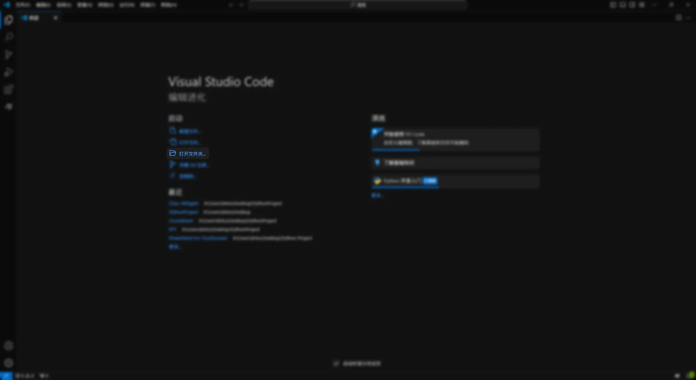

## 确认系统需求  

在配置开发环境之前，请确认您的桌面是否满足以下要求：  

> 🚧 对于 Windows 7 用户：
> 
> ~~由于本软件采用的库（PyQt6）已不再支持 Windows 10 以下的操作系统，在将来程序的库将逐步迁移至 PyQt5 以向下兼容 Windows 7。或您也可以尝试修改 Class Widgets 的代码，并打包一份兼容版本。~~
> 在最新的测试版本（1.1.7-Beta4）之后，软件已迁移至PyQt5，现已全面支持Windows7。  

但还是不推荐使用 Windows 7 进行开发。  
| 操作系统 | Windows 7 及以上 |
| --- | --- |
| 操作系统 | Windows 7 及以上 |
| 运行内存 | ≥ 4 GB |

若已满足，您还需要安装以下开发工具：  
这些资源在互联网上均有大量的安装教程，故不再提供  
● [Python 3.8.10](https://www.python.org/downloads/release/python-3810/)  
● [VS Code](https://code.visualstudio.com/) 或 [PyCharm](https://www.jetbrains.com/pycharm/) 等代码编辑器/集成开发环境  
● [Git](https://git-scm.com/downloads)  
## 获取 Class Widgets  

### 克隆 Class Widgets  

若您要参与 Class Widgets 的开发，则需要克隆 Class Widgets 的代码到本地。以构建您的 Class Widgets 可执行文件，且便于调试插件。  
您可以在 GitHub 中复刻（Fork）此项目的副本，再进行 Git 到本地开始开发。  
可使用 Windows 自带的“命令行”或“终端”或 VS Code 进行克隆（三种方式任选）：  
若您希望克隆您复刻的副本，请以您复刻的仓库  
首先，在资源管理器中打开要克隆到本地的文件夹，然后在地址栏输入cmd；  


打开命令行之后即可任选下面三种方式克隆：  

```

git clone https://github.com/{repo_owner}/Class-Widgets.git  

```

```

git clone git@github.com:{repo_owner}/Class-Widgets.git  

```

```

gh repo clone {repo_owner}/Class-Widgets  

```

### 安装 Requirements (依赖)  

在刚才执行克隆操作的命令行中输入  

```

pip install -r requirements.txt  

```

## 运行 Class Widgets  

完成上述操作后，即可按照接下来的步骤运行您的 Class Widgets。  
1打开 VS Code  
2点击“打开文件夹”并选择 您克隆的位置  



3即可打开 Class Widgets 项目