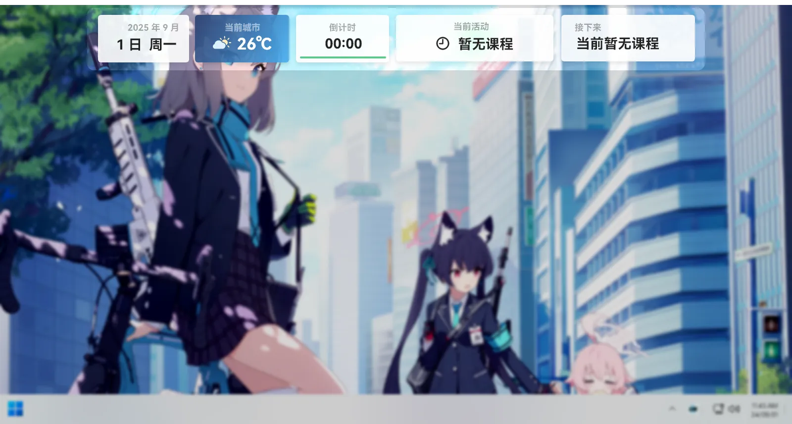
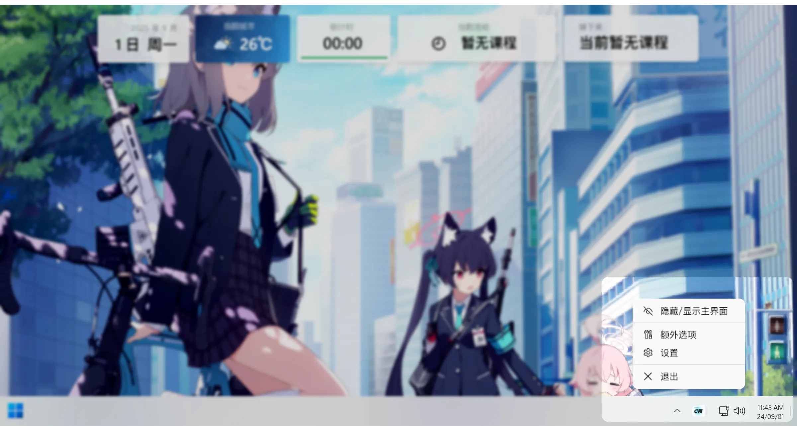
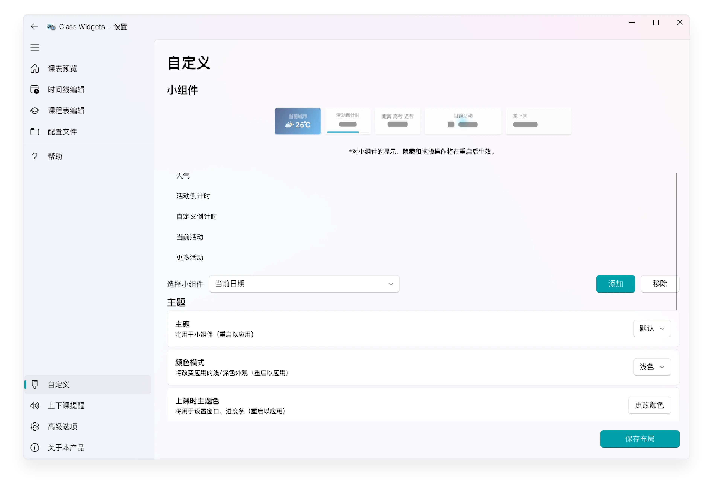

# 了解 Class Widgets

本文档将为您介绍 Class Widgets 的界面和基本操作。  
## 小组件（主界面）  

启动 Class Widgets 后，您将看到小组件会从屏幕顶部飞入。小组件将会显示设置好的课程表及当前日程。  
若需要暂时隐藏 Class Widgets，单击无功能的小组件后小组件将会收起并露出底部。若想再次显示，仅需点击小组件底部。  
若想完全隐藏 Class Widgets，请右键[托盘菜单](#y7zqb)并点击“显示/隐藏主界面”即可，若想恢复，再次点击该按钮即可。  
小组件也支持自定义，详见[“自定义”](#WUlwD)  
## 托盘菜单  

Class Widgets 启动后会在系统托盘区创建托盘图标，右键即可展开托盘菜单。若您未能看到托盘图标，请点击左侧的展开按钮。  
单击托盘图标，可快捷地让顶部的小组件隐藏；  
同时，在托盘菜单中，您可以访问软件的各个功能。  
## 自定义  

您可以通过“设置”中的“自定义”板块自定义小组件显示样式和信息。您可以在下拉栏选择需要添加的小组件，并根据需要对小组件进行添加/移除，且能更改关于小组件的设置。  
此外还能通过拖动列表中的小组件名称来改变排列顺序。  
详细操作详见 [“了解自定义”](https://www.yuque.com/rinlit/class-widgets_help/qyly70ht1ogge1pi)。