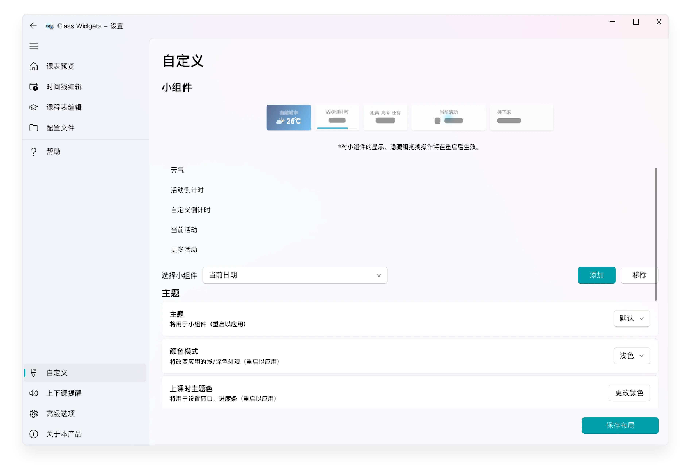
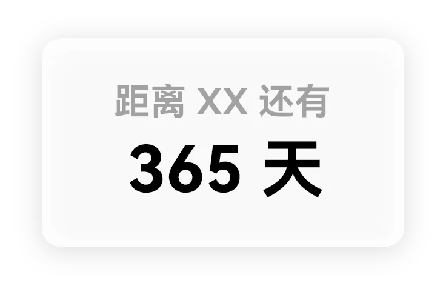
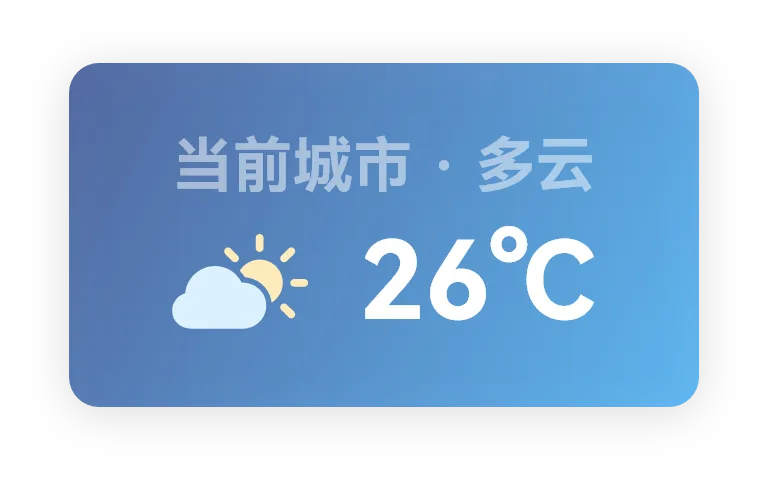

# 个性化 Class Widgets

本文将介绍 Class Widgets 中的“自定义”设置。  
## 介绍  

Class Widgets 支持多项自定义设置！您可以在此页面自由定义属于您的 Class Widgets。  
## 主题  

在 Class Widgets 中，您可以选择适合的主题。对于支持亮暗色的主题，将会在颜色模式切换时更换不同的风格。  
详见 [“主题”](./theme.md) 板块。  
### 自定义倒计时  

Class Widgets 支持在小组件中添加自定义倒计时，可用于选择特定节日（如：中、高考等）。  
仅需在“自定义”中“自定义倒计时”板块下填入节日日期和名称即可。  
💡 注意： 在使用“自定义倒计时”前，需添加这个小组件。  
### 天气  

Class Widgets 可获取所设定地区的天气信息，并以小组件的形式展示。您可以在“自定义”->“天气”板块下调整相关设置，详见[“天气”](https://www.yuque.com/rinlit/class-widgets_help/eyty3vbgx10gp5qo)。  
💡 注意：  
在使用“天气”前，需添加这个小组件。