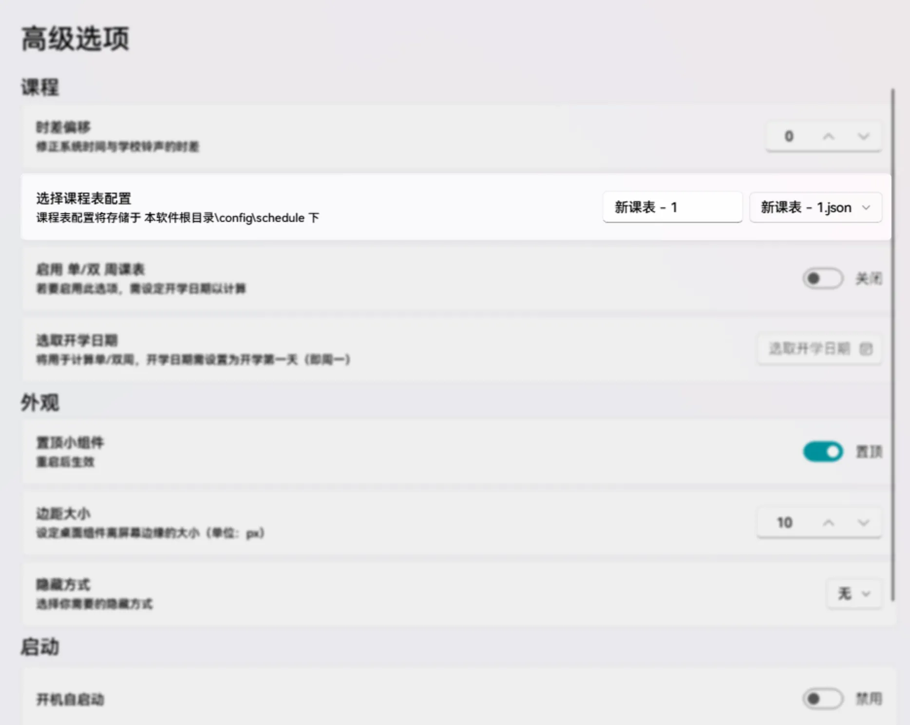

# 课程表文件
本文将为您介绍 Class Widgets 中切换课程表文件及导入、导出课程表文件。
## 创建\切换 课程表文件
在 Class Widgets，您可以创建多个不同的课程表文件。课程表文件也可以即时切换。

您可以在“设置”->“高级选项”中找到“选择课程表配置”选项卡，  
点击右侧的下拉栏，即可展开您本地中存储的所有课程表文件，同时您也可以在下拉栏的列表中点击“添加新课表”以创建新的课程表。  
另外，可以编辑在下拉栏左侧的文本框以更改课程表文件的名字。
## 课程表文件管理

此外，您还可以对这些文件进行导入/导出操作，您仅需在“设置”的侧边栏中选择“配置文件”进行。
