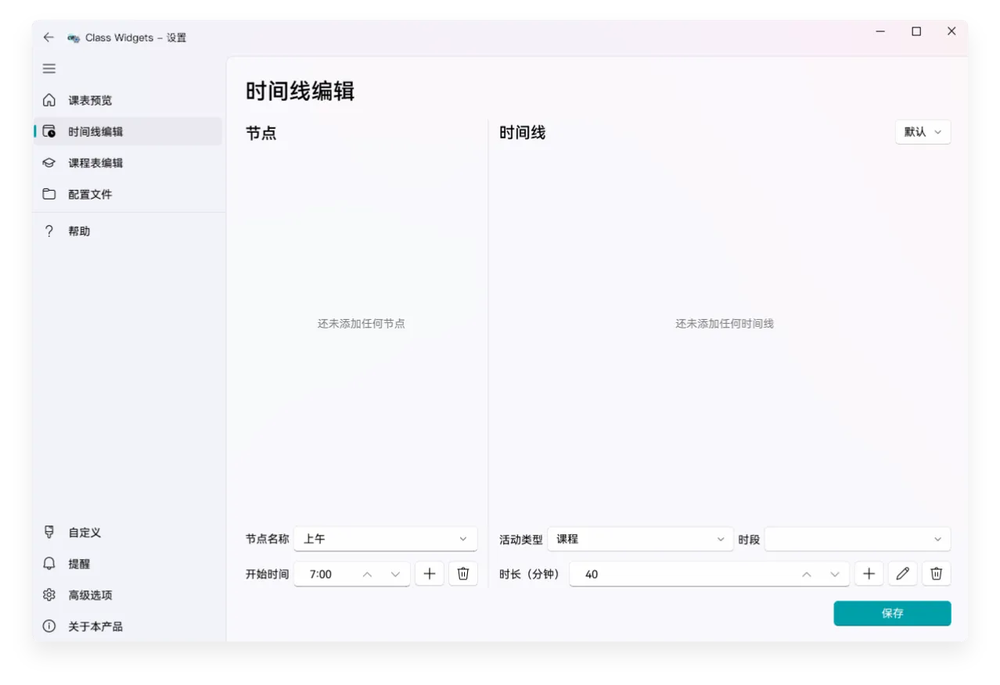
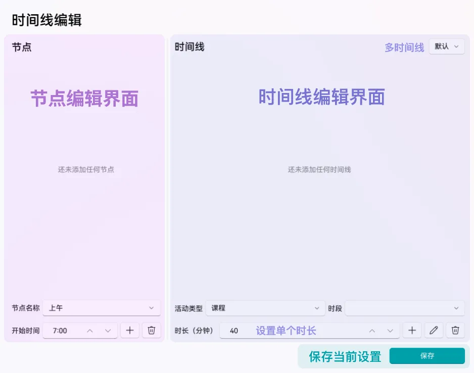
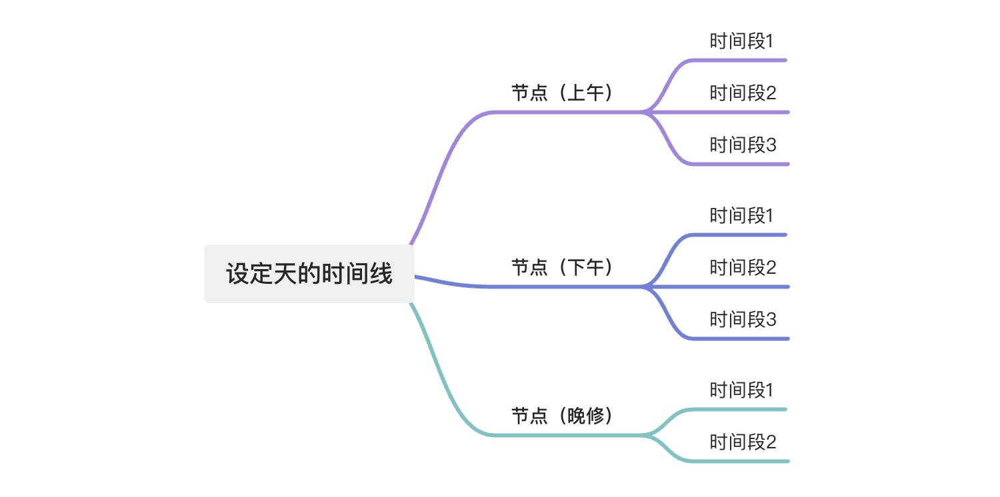
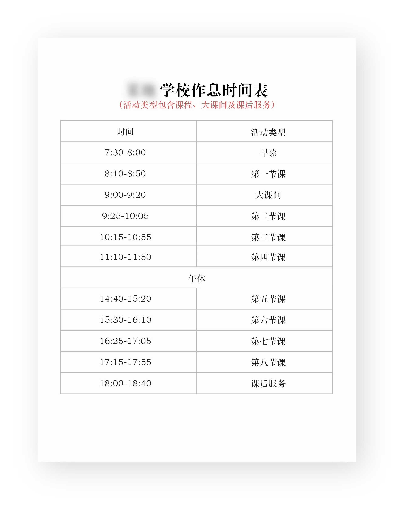
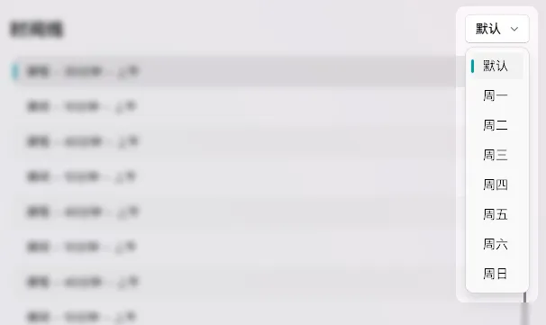
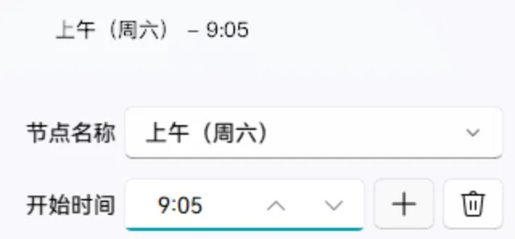

# 设置时间线

本文将为您介绍如何在 Class Widgets 中设置时间线  

:::warning
本篇教程仅适用于 v1.1.7 及以后版本，若您还在使用旧版 Class Widgets，请回到[“安装 Class Widgets”](../about_Class_Widgets.md)以升级您的软件。  
:::

## 介绍  

时间线规定了在一天中各个节点和活动时长，如课程、课间等。Class Widgets 将根据时间线及当前时间显示课程表中对应的课程。  

## 编辑时间线  

让我们了解如何设置时间线。  
设置界面分为上、下两个部分，在上面可以设置每个时段的“**节点**”（如：上午时段、下午时段和晚修），在下面可以分别为每个“节点”添加**时间段**（即活动类型，如：上课、课间、大课间等）。  
时间段：  
即一个有 <u>持续时间</u> 活动，但没有指定开始/结束时间，需要与“节点”配合使用。（如：上课、课间、大课间等）  
节点：  
是一天中一段时间内所有时间段的结合，通常会<u>指定一个开始时间</u>。在一个节点下的“时间段”会按顺序逐步累加起来成为一个时间段（如：上午时段、下午时段和晚修等） 
:::warning 
节点的时间采用<u>24小时制</u>，请注意不要写成<u>12小时制</u>。（目前已出现 3 次案例）  
:::

在每个编辑界面通常会配有三个操作按钮，分别对应“添加”、“编辑”及“删除”操作。可通过调整编辑页的选项以做出您希望的更改。  
### 设置节点  

接下来的教程将以这张来自于~~某个学校（划掉~~的作息时间表举例。  

在其中可以发现这一天的课程被分为了两个时段：  
| 时段 | 开始时间 |
| --- | --- |
| 时段 | 开始时间 |
| 上午 | 7:30 |
| 下午 | 14:40 |

接下来我们仅需根据 [图二](#编辑时间线) 将其依次录入“节点”列表中即可。
若您的学校时间安排在某些时候并不一致，请参考 多时间线录入 。  
### 添加时间线  

在节点设置完后，即可进行以下步骤。  
还是根据前文的课程表举例，从中我们能得到以下信息：  
| 活动类型 | 持续时长（分钟） |
| --- | --- |
| 活动类型 | 持续时长（分钟） |
| 课程（早读） | 30 |
| 课间 | 10 |
| 课程 | 40（课程通常为 40 分钟） |
| 课间 | 10 |
| 课程（大课间） | 20 |
| 课间 | 5 |
| 课程 | 40 |
| 课间 | 10 |
| 课程 | 40 |
| 课间 | 15 |
| … | … |

将其中的信息根据 [图二](#编辑时间线) 依次并填入即可。
若您的学校时间安排在某些时候并不一致，请参考 [多时间线录入](#多时间线录入) 。并在“默认”时间线中录入通常使用的时间线。
### 多时间线录入  

若您的学校在某天的时间安排与平常不一致，可将该天的时间线单独录入。  

首先，点击右上角的下拉框，选择您想要调整的星期即可。若您反悔，不希望改变当天时间线，只需把当日的所有时间点删除即可。  

若当天节点安排不一致，仅需添加另一个节点即可解决。