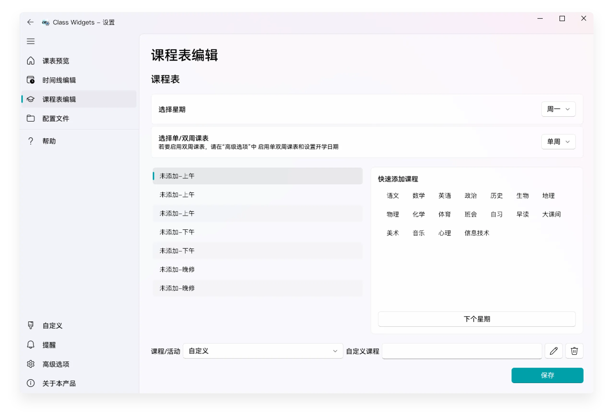
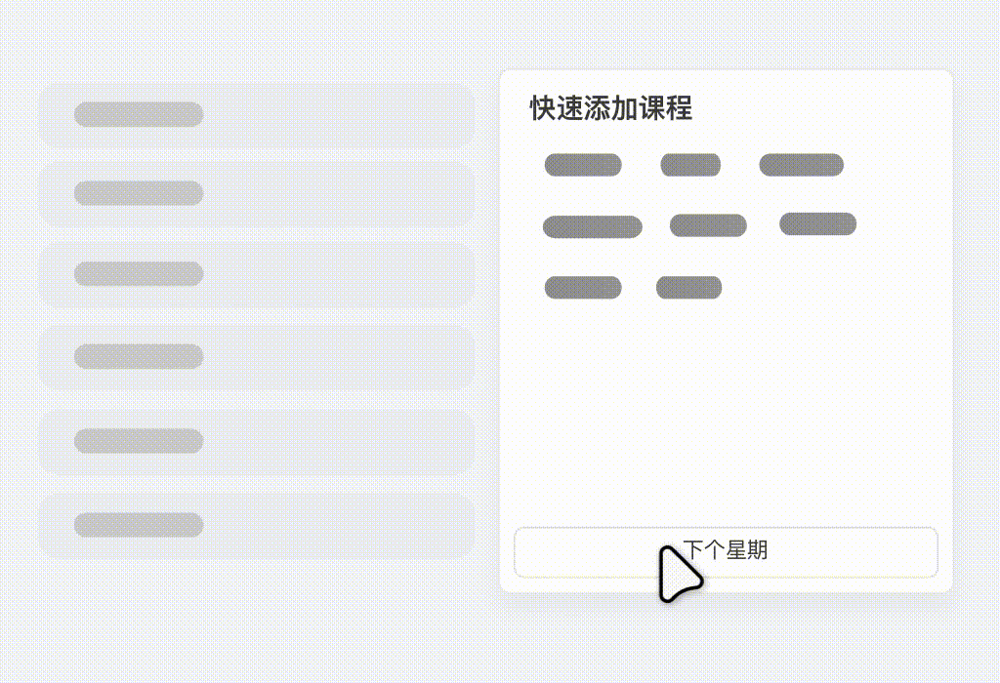

# 设置课程表

本文将为您介绍如何在 Class Widgets 中设置时间线  
在您按照要求设置完时间线后，即可观看本次教程  
## 介绍  

课程表指的是在一周中的课程安排。课表的时间安排由“时间线”控制，您在开始设置课程表之前，需设置时间线。（请参考 [“设置时间线”](./2.md)）  
## 设置课程表  

您可以使用下面的操作按钮和设置项对课程表进行添加操作。或使用“快速添加课程”功能快速配置课程。  
## 调休与换课  

Class Widgets 支持在这种特殊情况下切换当日课程和调整课程。关于此部分内容请参考 [“调休与换课”](./4.md)。