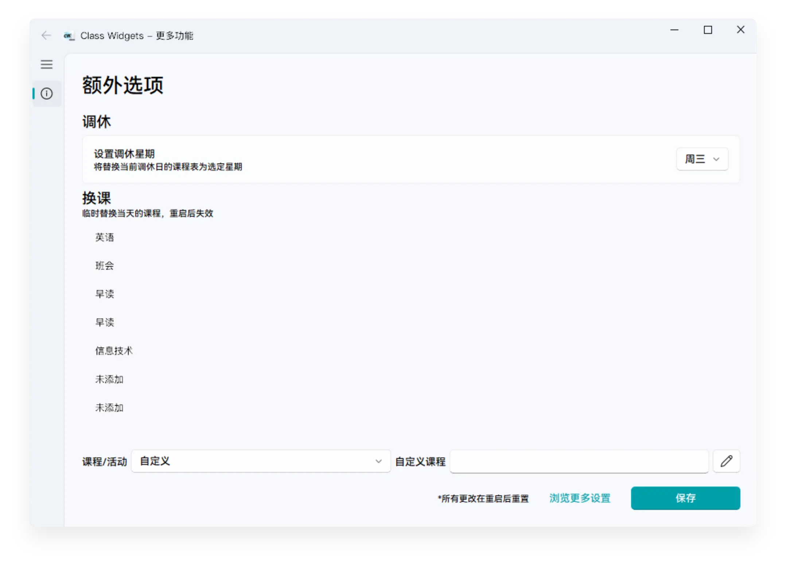
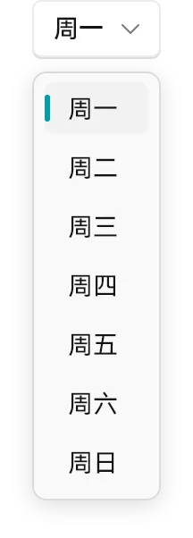

# 调休与换课

本文将为您介绍在课程计划有变时如何在 Class Widgets 中临时调整课程表。  
## 介绍  

在点击“**当前活动**”小组件或在托盘菜单点击“**额外选项**”后，您将见到此窗口。  
:::warning
自从 1.1.7-Beta4 后，若需要快速打开“额外选项”窗口，则需要右键“当前活动”小组件。（若您使用的是触摸屏，则可以长按进入）  
:::

在这个窗口，您可以调整当日课表内容及切换各个星期的课程表。

:::warning
在“额外选项”窗口中的“调休与换课”中的所有选项都会在 Class Widgets 重启后失效！  
若课程计划的变动是长期的，请在“设置”中更改。
:::

## 调休  

当您遇到调休（即在被调休节假日补课）或其他情况需要上其他星期的课程，  

您就可以打开“**额外选项**”窗口，点击“设置调休星期”选项卡右侧的下拉栏，选择您需要切换到的星期，设置完点击“保存”后 Class Widgets 将会应用所设定星期的课表。  
## 换课  

当今日课程计划有所变化时，可在“换课”板块下编辑课程表，设置完成后点击“保存”后 Class Widgets 将立即应用所设定的课程表。