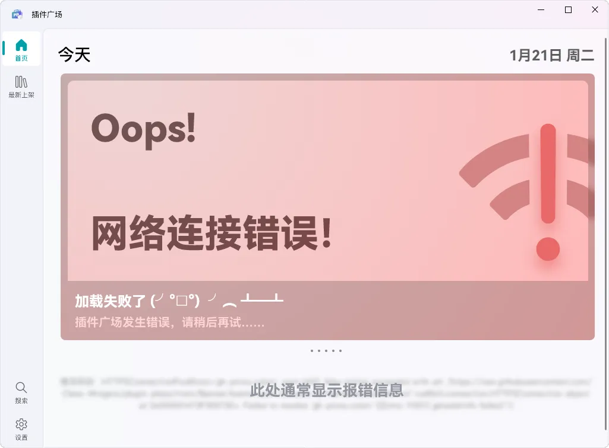
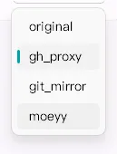

# “插件广场”无法联网

## 问题

当您在访问“插件广场”时发现如图的情况：

即意味着当前您暂时无法访问插件广场。

## 解决方案

可尝试更换当前所选的镜像源以解决问题。

1. 点击“插件广场”窗口中位于左下角的“设置”以进入设置页；
2. 切换一个镜像源；  
   
3. 重新打开插件广场。

## 仍无法解决？

请将附带有错误信息的截图（如图）在我们的社区中寻求帮助。
